# Data to Decision: Market Prices and Occupancy Analyzer

A market intelligence tool for **self-storage operators** that analyzes competitor prices + promos + demand signals and turns them into **clear pricing and revenue actions**.

---

## Overview

Self-storage pricing is hard because competitors change prices often, promotions distort the “real” rate, and occupancy alone doesn’t tell you if you are priced correctly.

This project solves that by:
- collecting competitor prices from public listings
- comparing your facility vs the local market
- showing where you are **underpriced / overpriced**
- estimating **revenue uplift** from better pricing
- visualizing **price vs distance, demand, promos, and ratings**

---

## Key Features

- **Competitor Price Benchmarking** (market average, market distribution)
- **Price Gap Insights** (how far your facility is from market average)
- **Promo Pressure Analysis** (how many competitors are running promos)
- **Demand Proxy / Opportunity View** (price vs demand quadrant + heatmap)
- **Rating + Price Value Positioning** (rating vs price bubble views)
- **Revenue Impact Estimate** (current vs recommended pricing impact)
- **Underpriced Competitor List** (who is pulling prices down)

---

## System Architecture

This is the high-level architecture showing backend modules, data layer, orchestration, and reporting flow.

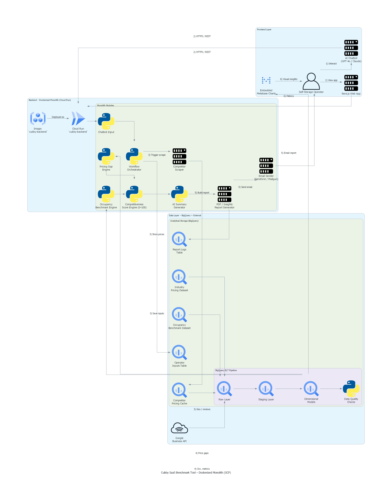

---

## Data Inputs

### Facility Inputs (Operator side)
- Location / ZIP
- Unit mix (examples: 5x5, 10x10, etc.)
- Current prices
- Occupancy or demand signal (if available)
- Promotions (if any)

### Market / Competitor Inputs (External)
- Competitor prices from public listings (example: Storage.com)
- Promo signals
- Distance from search center
- Ratings (where available)

---

## Main Outputs (What the tool generates)

### 1) Competitor price comparison (by facility)
Shows how competitor “lowest monthly price” compares with your facility.

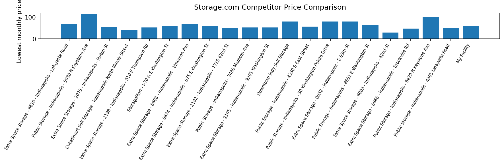

### 2) Market price distribution
A quick view of the spread of prices in the market.

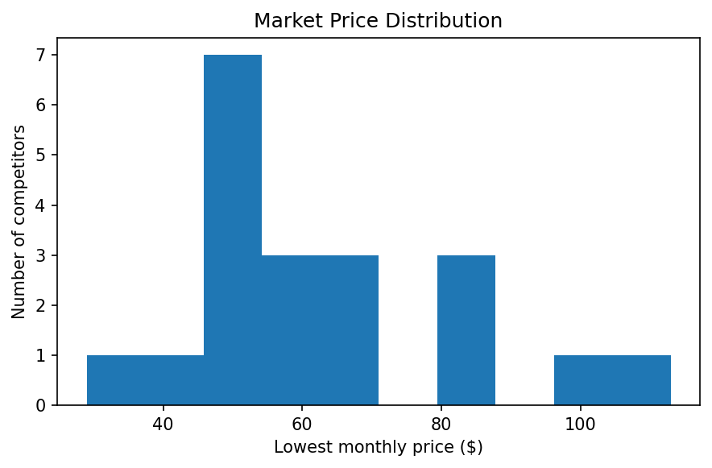

### 3) Price vs distance
Shows how prices change with distance, and where your facility sits.

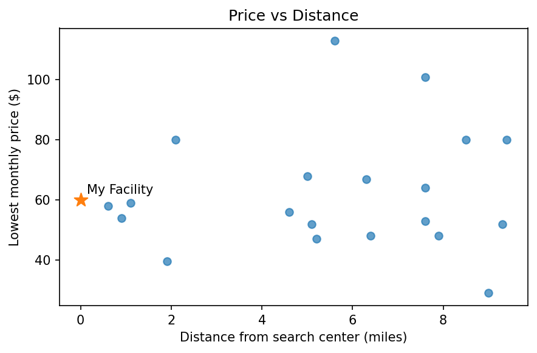

### 4) Price positioning vs market
Segments competitors into **Good / Fair / Risky** based on how far they are from market average.


### 5) Promo pressure in the market
Shows how many competitors are running promotions.

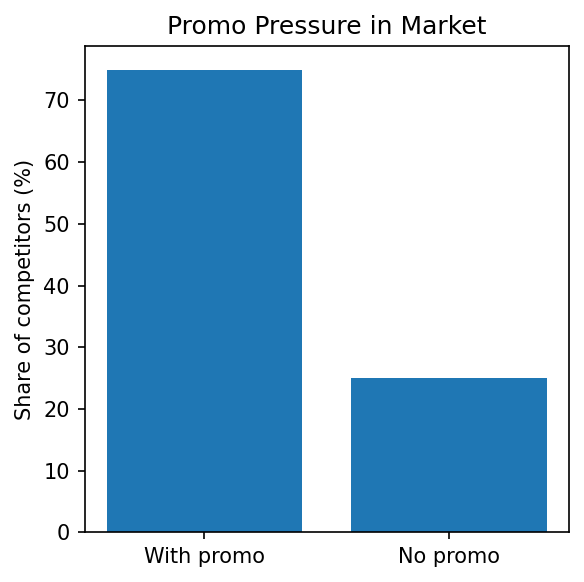

### 6) Discount dependence snapshot
Compares:
- no promo average price
- original price with promo
- discounted price with promo

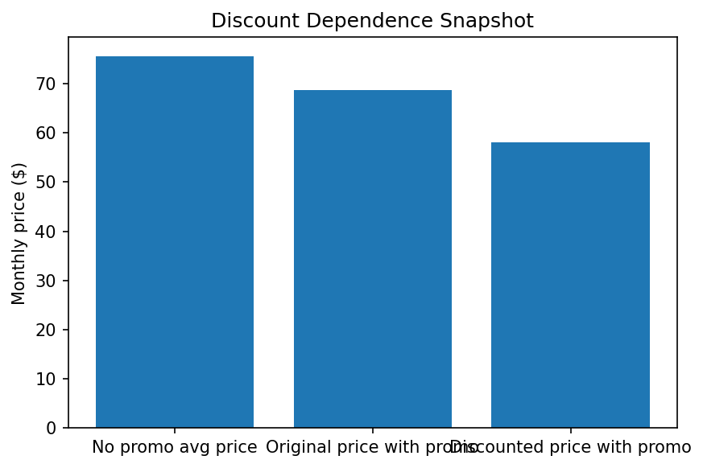

---

## Demand + Opportunity Views

### 7) Neighborhood demand heatmap (proxy)
A proxy demand view across distance bands and price bands.

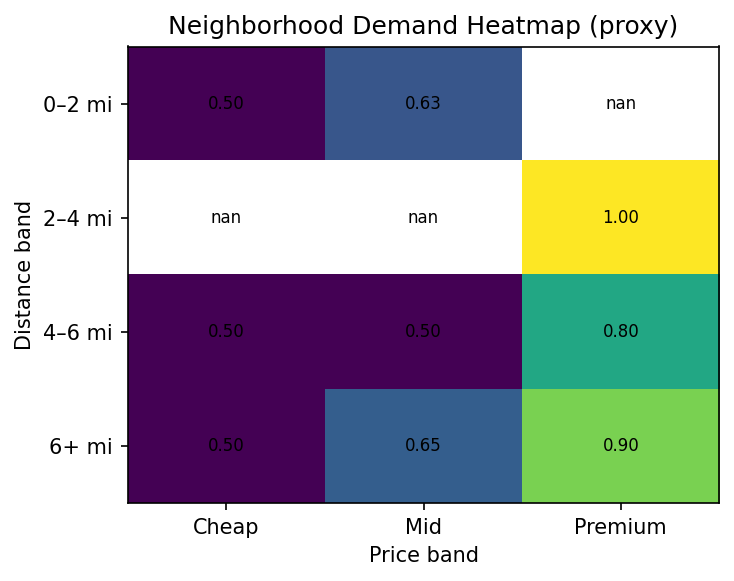

### 8) Opportunity quadrant: price vs demand
Helps decide whether to raise price, hold, or compete on price.

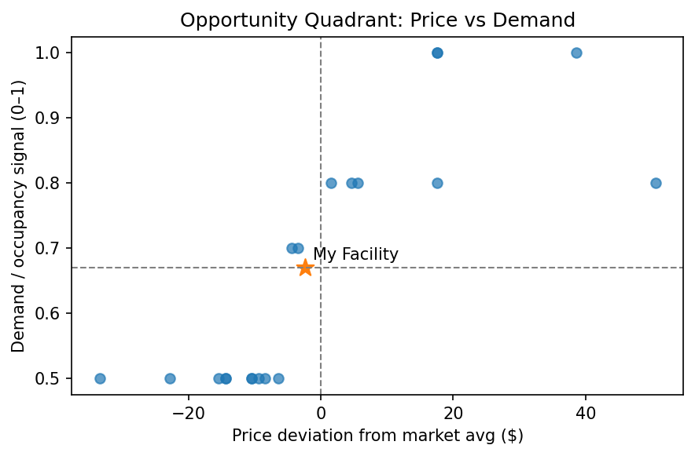

---

## Rating + Value Positioning

### 9) Price–Rating–Opportunity bubbles
Shows the relationship between ratings and pricing gaps to spot opportunity.

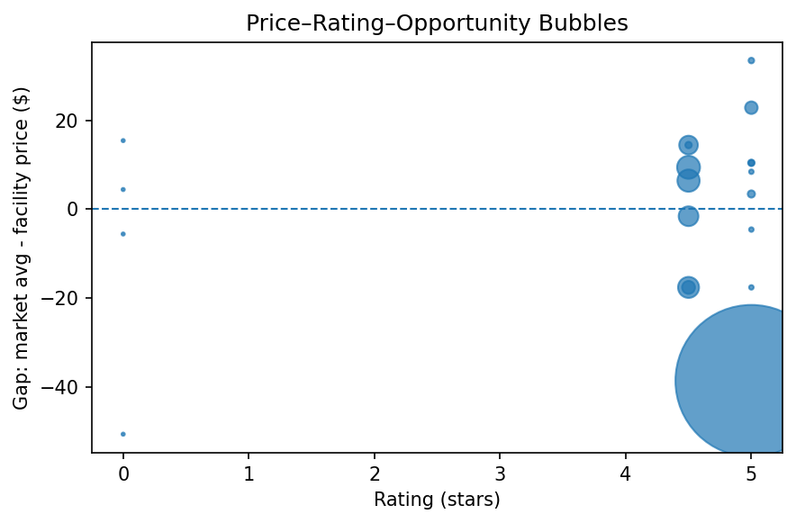

### 10) Rating vs price (value positioning)
A clearer view of where your facility sits on rating vs price.

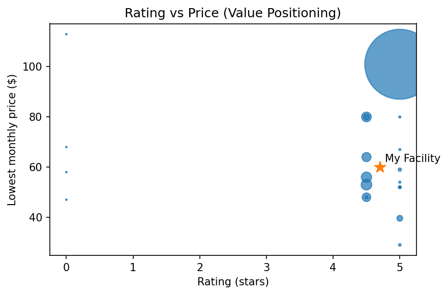

### 11) Promo usage by rating bucket
Shows promo usage across different rating ranges.

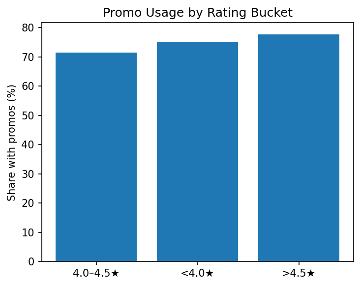

---

## Revenue + Actionable Insights

### 12) Revenue impact of price optimization
Compares estimated annual revenue at current vs recommended price.

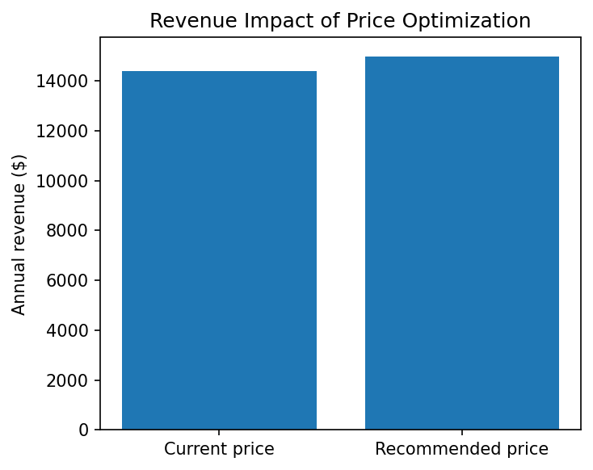

### 13) Top underpriced competitors (vs market average)
Highlights competitors that are priced far below the market average.

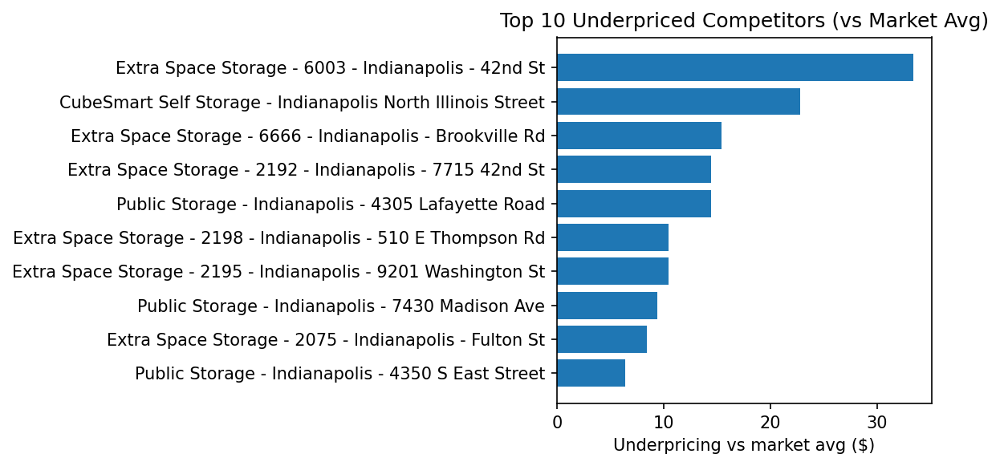

---

## Tech Stack (High level)

- **Python** (data collection + analysis + charts)
- **BigQuery** (warehouse / analytics tables)
- **FastAPI** (backend API)
- **Cloud Run** (deployment)
- Optional: **LLM summary layer** for reporting (OpenAI / Claude)

---

## How to Run (example)

### 1) Clone the repo
```bash
git clone <your-repo-link>
cd <your-repo-folder>
